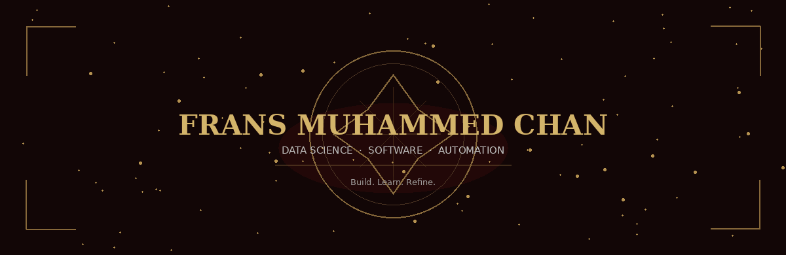

<div align="center">



<a href="https://github.com/fransmchn">
  
</a>

<br/><br/>


<br/><br/>


</div>


<pre align="center">
<code>
&gt; whoami
Data Science student, learning by building real systems.
Interested in the space where DATA, SOFTWARE and AUTOMATION collide.

&gt; status
There is a lot I don't know yet — and that's exactly
what makes building things interesting.
</code>
</pre>


## ABOUT

```yaml
identity:
  name: "Frans Muhammed Chan"
  role: "Data Science Student"
  focus: ["Data Science", "Software Development", "Automation"]
  exploring: ["Web Development", "Information Systems", "IoT", "Machine Learning", "Data Analysis", "System Design"]
  approach: "Learn → Build → Experiment → Improve"
```

I learn best by building real projects — designing systems, working with data, running experiments, breaking things, fixing them, improving a little every time. Not positioning myself as someone who already knows it all. I'm here to keep learning, keep building, and make every project better than the last.


## CURRENT STATE

<div align="center">

| IDENTITY | FOCUS | CURRENTLY | MINDSET |
|:---:|:---:|:---:|:---:|
| Data Science Student | Data · Software · Automation | Learning · Building · Experimenting | Curious · Persistent · Still Improving |

</div>

<details open>
<summary><b>HOW I LEARN</b></summary>
<br/>

- Learning by building, not just by theory
- Experimenting and debugging until it clicks
- Improving existing work instead of leaving it "done"
- Exploring new tech through practical projects

</details>


## CURRENT PROJECTS

<table width="100%">
<tr>
<td width="50%" valign="top">

### RESTOCK.IN
`Inventory Management System`

A web-based stock management application built to help retail owners understand inventory conditions and identify products that need attention.

**Focus:** Inventory Management · Data · Decision Support · Web Development


[`view repository →`](https://github.com/fransmchn/YOUR_RESTOCK_REPO)

</td>
<td width="50%" valign="top">

### GREENHOUSE
`IoT Monitoring & Automation`

An exploration project into greenhouse automation — environmental monitoring paired with automated watering.

**Focus:** Monitoring · Automation · Sensors · IoT · Systems


[`view repository →`](https://github.com/fransmchn/YOUR_GREENHOUSE_REPO)

</td>
</tr>
</table>


## TECH STACK

<div align="center">

**PROGRAMMING**
<br/>


<br/><br/>

**FRONTEND / WEB**
<br/>


<br/><br/>

**BACKEND**
<br/>


<br/><br/>

**DATABASE**
<br/>


<br/><br/>

**DATA**
<br/>


<br/><br/>

**TOOLS**
<br/>


<br/><br/>

**HARDWARE / IoT**
<br/>


</div>


## SKILLS BY AREA

<table width="100%"> <tr> <td width="25%" valign="top">

DATA

Python
Pandas
Scikit-learn
SQL
Data Analysis
</td> <td width="25%" valign="top">

DEVELOPMENT

JavaScript
TypeScript
PHP
React
Laravel
</td> <td width="25%" valign="top">

SYSTEMS

Next.js
MySQL
Git
GitHub
VS Code
</td> <td width="25%" valign="top">

EXPLORING

Machine Learning
IoT
Automation
System Design
Data Visualization
</td> </tr> </table> 

## LEARNING / EXPLORING / OPEN TO
<table width="100%"> <tr> <td width="33%" valign="top">

LEARNING

Data Science
Machine Learning
Data Analysis
SQL & Databases
System Design
IoT & Automation
</td> <td width="33%" valign="top">

EXPLORING

Data-driven applications
Practical Machine Learning
Better software architectures
Automation systems
Open source
Real-world problems
</td> <td width="33%" valign="top">

OPEN TO

Collaboration
Open source
Interesting projects
Tech conversations
Learning opportunities
New challenges
</td> </tr> </table> 

## GITHUB STATISTICS

<div align="center">


</div>

<div align="center">  </div> 

## CONNECT

<div align="center">

<a href="https://www.linkedin.com/in/frans-muhammed-chan/">

</a>
<a href="https://www.instagram.com/fransmchn_/">

</a>
<a href="https://github.com/fransmchn">

</a>

</div>

<br/>

<!-- Ruang untuk kamu tambahkan sendiri nanti:
     Featured Projects, Portfolio, Email, Additional Social Links,
     Certifications, Achievements, Education Details, Experience,
     Currently Building, Currently Reading, Fun Facts, Personal Interests -->

<div align="center">

</div>

<div align="center">
<i>"Build with purpose. Learn from the process. Keep moving forward."</i>
</div>
